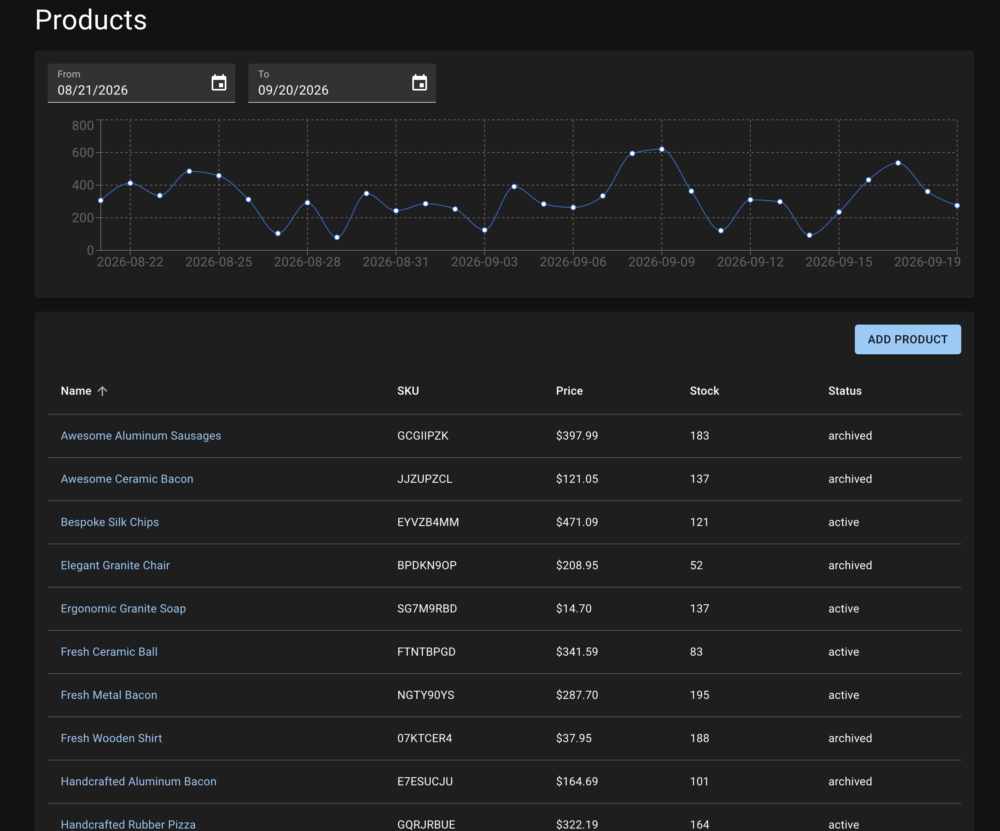

# Layered Integration Testing Strategy

This repository contains the example React application for my Medium article about **Layered Integration Testing (LIT)**—a testing strategy that aligns React tests with architectural boundaries and keeps the real component tree intact while mocking external infrastructure.

## Article

- [Read the article on Medium](https://medium.com/@YOUR_USERNAME/ARTICLE_SLUG) <!-- Replace with the published article URL. -->
- [Read the article in Markdown](./docs/article-template.md)

## Example App



The application demonstrates how to structure and test a modern React app across three architectural layers:

- **UI layer** — reusable UI components.
- **Business layer** — feature components and domain behavior.
- **App layer** — routes and application entry points.

Its tests show how to keep components and internal data flows real while mocking only external boundaries such as network requests.

## Technology Stack

### Application

- **React 19** and **React Router 8** for the UI and route-based application architecture.
- **TypeScript** and **Vite** for type-safe development and builds.
- **Material UI** and **Emotion** for the component library and styling.
- **Recharts** for data visualization.
- **Zod** for validation and **date-fns** for date handling.

### Testing

- **Vitest** as the test runner, with **happy-dom** as the browser environment.
- **React Testing Library**, **jest-dom**, and **user-event** for rendering components, querying the DOM, and simulating user behavior.
- **Mock Service Worker (MSW)** for intercepting HTTP requests at the network boundary.
- **miragejs-orm** for an in-memory relational test database, with **Faker**-powered factories that generate products, sales, and their relationships.

### Testing the Data Flow

The tests keep the complete application-owned request chain intact: route loaders call the real API functions, which call the real client and `fetch`. MSW intercepts the resulting request instead of replacing any intermediate function.

MSW request handlers read from and write to the `miragejs-orm` schema, allowing tests to create realistic, related data without a real backend. This combination verifies the full data flow while keeping tests deterministic and isolated from external services.

## Running Locally

The required Node.js version is defined in [`.nvmrc`](./.nvmrc).

```bash
pnpm install
pnpm dev
```

## Available Checks

```bash
pnpm test
pnpm typecheck
pnpm lint
pnpm build
```
