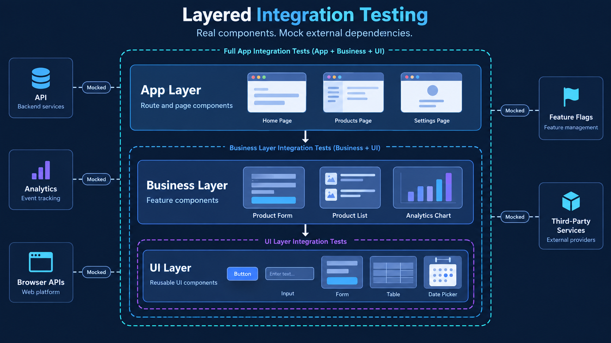
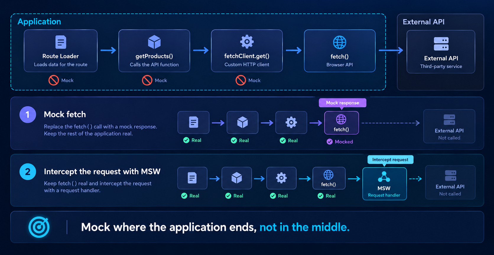

# Layered Integration Testing (LIT): A Practical Testing Strategy for Modern React Apps

Stop classifying React component tests as unit or integration tests. Choose the architecture first—its layers reveal what to keep real, what to mock, and why all you need is Layered Integration Testing.


## How This Article Saw the Light of Day


While exploring the Remix apps in my organization, I noticed the same pattern across multiple projects: **route and feature tests mocked almost every dependency**. These tests looked isolated, but they mostly verified that the mocks behaved exactly as configured - not that the components worked together. I call them **"imposter tests."**

Seeing this pattern repeated made me want to understand why teams end up here and share a more useful approach. So let's think together: what problems can lead to this mess?

## What Leads to This Mess?

### 1. Weak Architecture

Choosing the right architecture is critical not only for development, but also for testing. Splitting components by architectural layer gives each component a focused responsibility and creates clear boundaries around its dependencies. This keeps components thin, the component tree understandable, and dependencies shallow.

Without those boundaries, components accumulate responsibilities and grow into deep, tightly connected trees. Tests inherit that complexity, requiring more setup and more mocks just to cover a small piece of behavior. Good architecture prevents this and significantly reduces the effort needed to test the application.

### 2. Confusing Unit and Integration Testing

A task such as "add unit tests for this page" can push developers to mock everything except the render because a unit test is expected to isolate "the unit." But that instinct is misapplied at the route level. A route's job is to connect features to the router and compose them into a page, so testing a route is inherently an integration test.

If you need to test rendering in isolation, first separate the presentation from the business logic, then unit test the presentational component. Mocking every dependency of a route does not turn its test into a unit test - it only stops the test from verifying whether the integration actually works.

## What Is Layered Integration Testing?



### Component Architecture and Classification

I recommend starting every modern React application with a simple architectural design. Three layers are enough to establish clear responsibilities and dependency boundaries:

1. **UI layer** - reusable components that contain no application-specific business behavior. It includes primitives such as `Button`, `Input`, and `Icon`, as well as widgets that compose them into richer UI elements such as `Form`, `Table`, and `DatePicker`.
2. **Business layer** - feature components that represent pieces of the business domain, such as `ProductForm`, `ProductList`, or `SalesChart`. Features combine UI components with application behavior.
3. **App layer** - route components that serve as application entry points. Routes connect features to routing, data loading, and the page the user ultimately sees.

The UI layer does not need to be built entirely from scratch. It can build on established component libraries such as Material UI, Ant Design, Chakra UI, or Radix UI. Their components still belong to your UI layer: use them directly, or wrap them when you need consistent styling, defaults, accessibility behavior, or application-wide conventions. Business features should depend on this UI boundary instead of spreading library-specific details throughout the domain code.

The dependency direction should remain simple: routes compose features, and features compose UI components. Each layer owns a clear scope, which keeps components focused and makes their testing boundaries easier to identify.

### From Architecture to Folder Structure

These layers describe responsibilities, not a mandatory folder convention. Start with the simplest structure that works, then introduce stronger ownership boundaries as the application grows.

#### 1. Simple App Structure

A small Remix or React Router application can keep shared technical code and each architectural layer directly under `app`:

```text
app/
├── api/
│   └── products.ts
├── features/
│   ├── product-form/
│   └── product-list/
├── hooks/
│   └── use-products.ts
├── routes/
│   ├── products.$id.tsx
│   ├── products._index.tsx
│   └── products.new.tsx
├── ui/
│   ├── button/
│   ├── date-picker/
│   ├── form/
│   ├── icon/
│   ├── input/
│   └── table/
└── utils/
    └── format-price.ts
```

> **A note on naming:** I don't recommend generic legacy folder names such as `components/` or `common/`. They hide the purpose and architectural role of the code they contain. Folder names should be dictated by the architectural design and clearly communicate each component's responsibility and level of complexity. Names such as `ui/`, `features/`, and `routes/` make those boundaries explicit.

#### 2. Route-Scoped Structure

As routes become more complex, each route can own its API functions, hooks, features, and utilities. Shared UI components remain outside the routes:

```text
app/
├── routes/
│   ├── products._index/
│   │   ├── api/
│   │   │   └── products.ts
│   │   ├── features/
│   │   │   └── product-list/
│   │   ├── hooks/
│   │   │   └── use-products.ts
│   │   ├── utils/
│   │   │   └── filter-products.ts
│   │   └── route.tsx
│   ├── products.$id/
│   │   ├── features/
│   │   │   └── product-details/
│   │   └── route.tsx
│   └── products.new/
│       ├── features/
│       │   └── product-form/
│       └── route.tsx
└── ui/
    ├── button/
    ├── date-picker/
    └── table/
```

#### 3. Domain-Oriented Structure

When the application grows across several business domains, group each domain's API functions, features, hooks, routes, and utilities together:

```text
app/
├── domains/
│   ├── product/
│   │   ├── api/
│   │   │   └── products.ts
│   │   ├── features/
│   │   │   ├── product-details/
│   │   │   ├── product-form/
│   │   │   └── product-list/
│   │   ├── hooks/
│   │   │   └── use-products.ts
│   │   ├── routes/
│   │   │   ├── product.tsx
│   │   │   ├── products.tsx
│   │   │   └── new-product.tsx
│   │   └── utils/
│   │       └── format-product.ts
│   └── sales/
│       ├── api/
│       ├── features/
│       │   └── sales-chart/
│       ├── hooks/
│       ├── routes/
│       └── utils/
├── ui/
│   ├── button/
│   ├── date-picker/
│   └── table/
└── routes.ts
```

#### 4. Monorepo Structure

If the application becomes large enough to require further separation and independent scalability, consider moving domains or major features into dedicated packages within a monorepo:

```text
apps/
└── web/
    └── app/
        ├── routes/
        ├── root.tsx
        └── routes.ts
packages/
├── product/
│   ├── api/
│   ├── features/
│   ├── hooks/
│   ├── routes/
│   └── utils/
├── sales/
│   ├── api/
│   ├── features/
│   ├── hooks/
│   ├── routes/
│   └── utils/
└── ui/
    ├── button/
    ├── date-picker/
    └── table/
```

This structure allows a separate team to own, develop, and test each domain or feature while the application composes those packages into a single product. Domains can also move into separate repositories when they need stronger isolation or independent release cycles. Both approaches add tooling and coordination overhead, so explore them when the size of the application and organization justifies the extra boundary.

The exact layout can change without changing the architecture. What matters is that UI components, business features, and application entry points retain distinct responsibilities and predictable dependency boundaries.

### Rules and Principles

The traditional unit-versus-integration distinction becomes less useful when testing React components. Even a test for a simple `Button` does more than check a function's return value: it renders the component into a DOM and exercises browser behavior such as focus, event propagation, and accessibility semantics. In the classical sense, the component is already being tested through an integration.

The same idea applies throughout the architecture. A UI component integrates with the DOM and with other UI components. A business feature integrates real UI components with business behavior. An app route integrates real features with routing and data loading.

That leads to three principles:

- **Align tests with architectural boundaries.** Test a component according to the responsibility of its layer: UI behavior in the UI layer, domain behavior in the Business layer, and application composition in the App layer. If a test requires excessive setup or mocking, the architectural boundary may be the real problem.
- **Keep the component tree real.** Do not mock child components merely to make the subject look isolated. This also applies within the UI layer: a `Form` should be tested with its real `Button` and `Input` components.
- **Mock only infrastructure.** Infrastructure sits outside your rendered component tree and includes network calls, browser or OS APIs, timers, analytics, feature-flag clients, and third-party SDKs. Mocking these boundaries keeps tests deterministic without replacing the application behavior you need to verify.

The core rule is simple: **when testing a component at any architectural layer, keep its component subtree real and mock only the infrastructure outside it.**

### Layers and What Gets Mocked at Each One

1. **UI layer** - test primitives and widgets through their behavior in the DOM. When a `Form` composes a `Button` and an `Input`, keep those components real and test how they work together. There is usually little to mock at this layer beyond infrastructure such as browser APIs, `localStorage`, or the system clock. If a component comes directly from a third-party UI library, do not retest the library's internals; test only how your application configures or composes it.
2. **Business layer** - render feature components with their real UI subtree. Mock infrastructure such as API calls, analytics, feature flags, and third-party SDKs, then verify the domain behavior through what the user can see and do. Route-owned dependencies outside the feature's responsibility, such as navigation, URL parameters, or route-provided data, can also be mocked here; their real wiring is verified at the App layer. Mocking the UI components would remove the integration this layer is responsible for testing.
3. **App layer** - render route components with their real features and UI components inside a realistic router. Keep route wiring, loaders, actions, and the flow of data into features intact; mock the network or other infrastructure behind them. When testing navigation, a destination route can be represented by a minimal test route because it is a separate application entry point, not a child dependency of the route under test.

The mocking boundary remains consistent at every layer: keep your component subtree real and replace only the infrastructure outside it.

### Test the Data Flow the Same Way



A typical request in a modern React application passes through several internal layers:

`route loader → getProducts() → fetchClient.get('/products') → fetch() → network`

You could mock the loader, the API function, or the custom client, but every intermediate mock breaks this chain and hides whether those pieces are wired together correctly. Apply the same LIT rule to data flow: keep application-owned calls real and mock only the external boundary.

There are two practical ways to do this:

1. **Mock `fetch`.** Use a library such as [fetch-mock](https://www.wheresrhys.co.uk/fetch-mock/) to replace the external Fetch API while allowing the real loader, API function, and client wrapper to execute.
2. **Intercept network requests.** Use [Mock Service Worker](https://mswjs.io/) request handlers to provide mocked responses at the network level while keeping `fetch` and the entire application call chain untouched.

The tool is less important than the boundary: mock where your application ends, not somewhere in the middle of its data flow.

### Now You See Why It’s Called Layered Integration Testing

The strategy follows directly from the architecture: UI components integrate with the DOM and with other UI components, business features integrate real UI with domain behavior, and app routes integrate real features into the application. At every boundary, the component subtree stays real while only external infrastructure and dependencies owned by higher layers are mocked.

**Test each layer against the real thing beneath it, not a puppet wearing its name.**

If you want to dive deeper and see Layered Integration Testing in practice, explore the [example application](https://github.com/iamkyrylo/lit-testing-strategy) and its real testing scenarios. Clone it, run the test suite, and see how the same principles apply across UI components, business features, routes, and data flow.

Thanks for reading—and good luck building tests that reflect how your application actually works!
